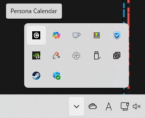

# デスクトップカレンダーApp
ペルソナ5のカレンダーシステムのUIのようなデスクトップアプリケーション

## 機能
1. 日付機能
    - 今日の日付，曜日を表示
    - 日付の確認はアプリを立ち上げてから1分ごとに行われる
2. 休日機能
    - 土曜日は青色，日曜日と祝日は赤色に変化
    - なお現在対応している祝日は2026年まで（それ以降は更新する必要あり）
3. 天気予報機能
    - 東京の天気を「晴れ・曇り・雨」の3つで表示
    - 天気の更新はアプリが立ち上がったときのみ
4. 表示位置変更
    - ドラッグで自由に移動可能

## インストール方法（Windowsのみ対応）
1. [relese](https://github.com/N-Keisho/persona-calender/releases) ページより `latest` の `Setup.exe` をダウンロード
    - `Source code` はインストールには不要です
2. `Setup.exe` を実行
3. 「WindowsによってPCが保護されました」と出るので，「詳細情報」押下後，「実行」を押す
4. Windowsから「このアプリがデバイスに変更を加えることを許可しますか？」と問われるので「はい」を押す
5. インストール先のフォルダを選択
    - どこでも大丈夫だが，基本はデフォルトでOK．
    - デフォルトは `C:/ProgramFile/Persona Calender`
6. インストール完了

## PC起動時に自動で立ち上げるようにする方法
PC起動時に自動では立ち上げるためには設定が必要です．
1. エクスプローラの検索バーに `shell:startup` と入力して移動する

2. 新規作成 > ショートカットを作成
3. ショートカットのパスを `Persona Calendar.exe` のパスに設定
    - インストール時にデフォルトの場所にしていれば，`C:\Program Files\Persona Calendar\Persona Calendar.exe` になっているはず
4. ショートカットが正常に動くことを確認
    - ショートカットを押して，Persona Calendarが起動すれば，次回以降自動で立ち上がってくれます

## 停止方法
1. タスクバー右側のタスクトレイを開く
    - 「^」のボタン
2. Persona Calender（「C」のアイコン）を右クリック

3. `Quit` 押下でアプリが終了します

## 削除方法
1. `Persona Calendar.exe`があるフォルダを開く
2. 同じフォルダに `Uninstall Persona Calendar.exe` があるので，実行
3. Windowsから「このアプリがデバイスに変更を加えることを許可しますか？」と問われるので「はい」を押す
4. 右下の「アンインストール」を押す

## メンテメモ
### アプリビルドについて
-  `npm run dist` 実行でビルドが走る． `dist` 配下に生成物ができる
    - インストーラだけreleseに登録すればOK
- package.jsonのバージョンを上げること

### 祝日について
- 祝日は `data` フォルダの中にjson形式で保存している
- 内閣府ホームページから正確な祝日を取得できる
    - https://www8.cao.go.jp/chosei/shukujitsu/gaiyou.html
- 過去例を参考に，ChatGPTに投げて生成しよう

## 過去ログ
- ElectronとHTML/CSS/Jacascriptで実装
- あとになって表示はSVGでいろいろやったほうがよかったんじゃないかと思ってる
- デザインはできる限り似せたが，細かいところは違う...
- 天気はAPIを使って，東京の天気を表示している
- 祝日判定はJson登録しているので，1年ごとに更新する必要あり

