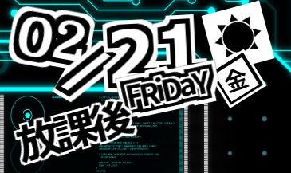

# デスクトップカレンダーApp
- ペルソナ5のカレンダーシステムのUIのようなアプリが欲しかったので作ってみた
- ElectronとHTML/CSS/Jacascriptで実装
- あとになって表示はSVGでいろいろやったほうがよかったんじゃないかと思ってる
- デザインはできる限り似せたが，細かいところは違う...
- 天気はAPIを使って，東京の天気を表示している
- 祝日判定はJson登録しているので，1年ごとに更新する必要あり

